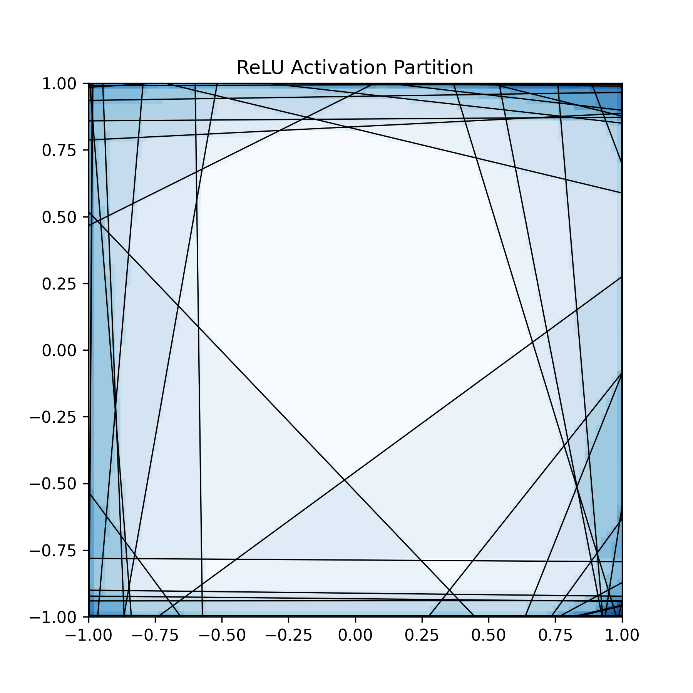
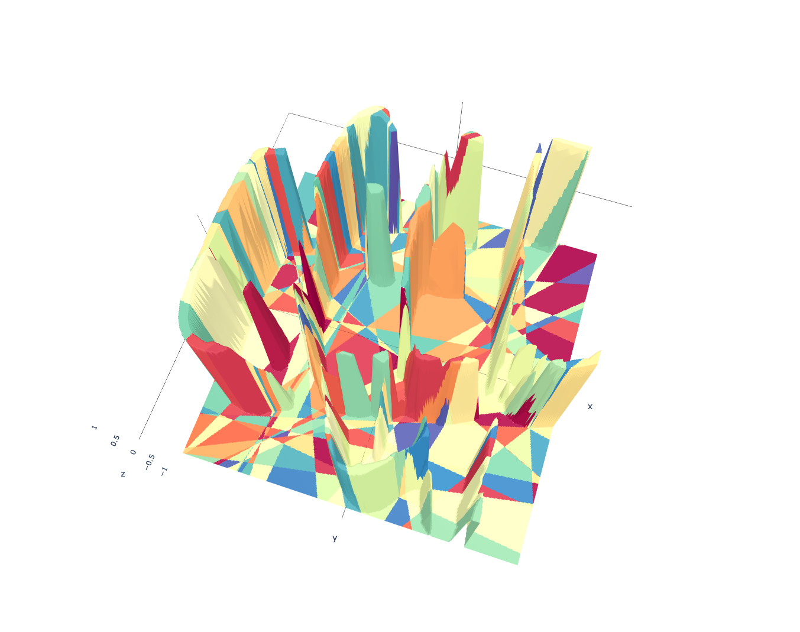

_Me_: 삼각수(triangular number)는 relu function의 (2d plane max division) - 1이다.

Idea from [here](https://blog.janestreet.com/visualizing-piecewise-linear-neural-networks/#fnref:1).

> This is relu partition visualization!

> And here we get this activation function in hands.

$$
+relu(-0.0002x-0.0002y-0.0008)-relu(0.3072x-0.0691y+0.1002)+relu(-0.4091x-4.7289y-3.4448)+relu(-7.6841x+4.8093y-3.2078)-relu(1.2132x-0.6669y+0.3159)+relu(-0.0002x+0.0002y-0.0007)-relu(1.2175x-0.5239y+0.1810)+relu(0.5965x-0.3149y+0.0802)-relu(-0.1104x-0.3971y+0.1884)-relu(1.1903x-0.5136y+0.1795)-relu(-0.3740x-0.1050y+0.1575)+relu(0.6091x-0.3216y+0.0819)+relu(0.2351x-0.9041y+0.6577)-relu(-0.0766x+1.0903y+0.5703)-relu(0.4405x-0.0001y+0.1984)-relu(0.0783x-0.7998y+0.0288)-relu(0.3531x+0.1135y+0.1628)-relu(0.0817x-0.8349y+0.0300)-relu(-1.7473x-0.6263y-1.3097)+relu(0.9154x+1.1155y+0.9601)-relu(-0.4116x-0.1156y+0.1733)-relu(-0.1075x-0.3866y+0.1835)-relu(0.8461x-0.3640y+0.1252)-relu(-0.3466x-0.0973y+0.1460)+relu(-0.4479x-5.1958y-3.7844)-relu(-0.3843x-0.1079y+0.1618)+relu(-2.2422x+0.6722y-1.4006)-relu(-0.1029x-0.3876y+0.1768)+relu(0.3620x+38.5460y-21.9805)+relu(0.2521x+0.2558y-0.0754)-relu(0.3205x-0.3015y+0.1812)-relu(0.9720x+0.0108y+0.4452)+relu(-0.0000x+0.0000y-0.0001)-relu(-0.1545x-1.2227y-0.1227)+relu(-0.0341x+0.3688y-0.0282)-relu(-0.0765x+1.0882y+0.5692)+relu(0.0006x+0.0001y-0.0007)-relu(0.0883x-0.8997y+0.0323)-relu(0.1014x-1.0335y+0.0371)+relu(-0.6103x-2.7973y-0.6773)+relu(0.9975x+1.2208y+1.0465)+relu(-0.0000x+0.0000y-0.0001)+relu(0.0000x+0.0000y-0.0001)+relu(-2.8586x+0.0003y-1.6392)-relu(-0.4099x-0.1151y+0.1726)+relu(-11.2599x+9.5986y+3.7455)-relu(0.1331x+2.7051y-1.8448)+relu(-0.0004x+0.0007y-0.0011)+relu(3.1749x-11.9956y-10.6398)+relu(-0.2023x-2.4494y-0.3923)-relu(-0.0752x+1.0704y+0.5599)+relu(-0.6186x-2.8351y-0.6864)-relu(-0.4915x+0.9422y+0.4804)+relu(0.9377x+0.8873y+0.9246)+relu(0.7027x+0.6968y+0.7388)+relu(-0.0335x+0.2596y-0.0237)+relu(-0.0001x+0.0000y-0.0001)+relu(0.2556x+0.2613y-0.0754)+relu(0.6315x-0.3334y+0.0849)+relu(0.0004x+0.0002y-0.0005)+relu(-2.3394x+1.2370y-0.3073)+relu(1.0592x+0.9974y+1.0414)-relu(-0.1531x-1.2109y-0.1216)+relu(0.0009x-0.0000y-0.0009)-relu(0.0971x-0.9902y+0.0356)+relu(5.3581x-12.9156y-8.2964)+relu(-2.7368x-0.0092y-1.5724)-relu(-0.1058x-0.3806y+0.1806)-relu(0.0803x-0.8210y+0.0295)+relu(1.2717x+1.5820y+1.3344)-relu(-0.0778x+1.1079y+0.5795)-relu(0.0787x-0.8038y+0.0289)+relu(-0.0003x+0.0002y-0.0006)+relu(-1.3678x+1.0501y+1.0079)-relu(-0.1081x-0.4065y+0.1856)-relu(-2.0667x-0.5668y-1.4678)+relu(0.0001x-0.0000y-0.0002)-relu(-0.4812x+0.9226y+0.4704)-relu(0.0891x-0.9086y+0.0326)-relu(-0.8088x+0.3486y+0.4164)-relu(-0.1502x-1.1872y-0.1198)+relu(0.2485x+0.2540y-0.0733)+relu(-2.3565x+1.2460y-0.3096)+relu(-0.0339x+0.2629y-0.0240)-relu(0.3328x+0.1272y+0.1532)+relu(-0.6261x-1.2611y+0.6446)-relu(0.3390x+0.1023y+0.1571)+relu(-0.0003x-0.0000y-0.0007)+relu(2.5086x+21.4752y-5.9129)+relu(-0.0918x-7.4384y+2.7375)+relu(0.0000x+0.0000y-0.0000)+relu(-0.0001x+0.0000y-0.0002)-relu(-2.4693x-0.6775y-1.7542)-relu(0.1811x+3.7064y-2.5258)+relu(0.2549x+0.2605y-0.0752)+relu(0.0001x-0.0005y-0.0009)-relu(-0.0968x-0.3641y+0.1663)+relu(-0.0003x+0.0003y-0.0009)-relu(0.6048x-0.4128y+0.3518)-relu(0.6173x-0.4212y+0.3590)-relu(-0.1074x-0.3866y+0.1834)+relu(0.0001x+0.0001y-0.0005)-relu(-0.1517x-1.2001y-0.1204)-relu(0.6110x-0.4170y+0.3560)-relu(0.3754x-0.0101y+0.1623)+relu(-2.7807x-0.0111y-1.5984)+relu(-2.1029x+0.7356y-1.2985)+relu(2.9748x+0.7137y-1.5267)+relu(9.2329x-9.0290y+3.4844)-relu(-0.3511x-0.0985y+0.1478)-relu(-0.4696x+0.9006y+0.4590)-relu(-0.5057x+0.9227y+0.5021)-relu(-0.1070x-0.4019y+0.1838)-relu(-0.1512x-1.1955y-0.1199)+relu(-0.0000x+0.0000y-0.0001)+relu(-0.0000x+0.0005y-0.0008)+relu(-0.0004x+0.0002y-0.0011)+relu(0.2199x+0.2239y-0.0653)+relu(0.2716x+0.2777y-0.0801)-relu(-0.8081x+0.3438y+0.4150)-relu(-0.8797x+0.2440y+0.4257)+relu(-0.0002x-0.0001y-0.0004)+relu(0.2117x-0.1085y+0.1590)-relu(-0.4752x+0.8669y+0.4718)+relu(-0.0378x+0.4090y-0.0313)+relu(0.2259x+0.2275y-0.0685)+relu(4.6916x+34.9289y-22.7223)+relu(-0.9118x-5.8687y-4.4293)-relu(0.0797x-0.8149y+0.0293)+relu(-0.0367x+0.3979y-0.0305)+relu(0.0009x-0.0000y-0.0009)+relu(0.0000x+0.0010y-0.0012)-relu(-0.9762x+0.2670y+0.4720)-relu(-0.1081x-0.4068y+0.1856)-relu(-0.1522x-1.2041y-0.1208)+relu(0.5809x+1.2562y+0.9200)+relu(-0.0007x-0.0001y-0.0010)-relu(0.3239x+0.0977y+0.1502)-relu(0.9390x+0.0118y+0.4313)+relu(-0.0000x-0.0000y-0.0000)-relu(-0.4795x+0.9195y+0.4687)-relu(-0.1085x-0.3902y+0.1852)-relu(-0.0888x-0.3340y+0.1526)-relu(-0.4843x+0.8836y+0.4809)-relu(1.2158x-0.5246y+0.1833)-relu(0.8510x-0.3662y+0.1259)+relu(0.2647x+0.2687y-0.0792)-relu(0.5360x-0.0062y+0.2373)-relu(-0.4850x+0.8848y+0.4815)+relu(-1.5304x+1.0029y+1.1110)+relu(0.0002x-0.0004y-0.0011)-relu(-0.5164x+0.9451y+0.5132)-relu(-0.3493x-0.0980y+0.1471)+relu(-0.5681x-1.3305y+0.6123)+relu(2.8002x+0.6717y-1.4372)-relu(-0.1512x-1.1955y-0.1207)-relu(-0.4864x+0.9082y+0.4833)-relu(-0.0748x+1.0642y+0.5566)-relu(-0.0736x+1.0473y+0.5478)-relu(0.3068x+0.1546y+0.1660)+relu(0.0000x-0.0001y-0.0002)-relu(-0.9699x+0.2653y+0.4689)-relu(7.0041x+1.8986y-3.0992)-relu(-0.8301x+0.3414y+0.4239)-relu(0.6100x-0.4161y+0.3550)+relu(0.6126x-0.3234y+0.0824)+relu(1.4620x-10.9964y-9.1281)+relu(-0.0002x+0.0003y-0.0005)-relu(-0.1083x-0.4067y+0.1860)+relu(-0.4309x-5.0002y-3.6420)+relu(0.5728x-0.3024y+0.0770)+relu(-0.1011x-8.1979y+3.0171)+relu(-0.0001x-0.0002y-0.0005)+relu(0.9345x+1.1342y+0.9840)-relu(0.8495x-0.3655y+0.1257)-relu(-0.0980x-0.3686y+0.1683)+relu(-0.0001x+0.0005y-0.0008)+relu(-0.2089x-2.5286y-0.4050)-relu(-0.4734x+0.8636y+0.4700)-relu(-0.3709x-0.1041y+0.1562)+relu(-0.0003x-0.0000y-0.0004)-relu(-0.3692x-0.1036y+0.1554)-relu(0.1001x-1.0211y+0.0367)-relu(1.0117x-0.4361y+0.1517)+relu(0.2598x+0.2404y-0.0371)-relu(-0.1119x-0.4204y+0.1922)+relu(-1.7351x-1.6148y+1.5252)+relu(-1.4841x+0.9735y+1.0774)+relu(-0.5555x-1.3130y+0.6002)+relu(0.6104x+1.3209y+0.9670)-relu(0.3470x+0.1021y+0.1607)+relu(-0.2040x-2.4730y-0.3960)-relu(9.2640x-4.3030y-8.8956)-relu(0.0964x-0.9838y+0.0353)+relu(-1.2223x-5.9762y-4.6378)+relu(0.8244x+1.1080y+1.0365)+relu(7.1957x+0.4006y-3.5741)-relu(-0.4924x+0.9040y+0.4898)+relu(0.0013x-0.0000y-0.0014)+relu(-0.0062x+0.0473y-0.0043)-relu(0.5423x+0.0035y+0.2468)+relu(-1.6680x+1.0609y+1.2127)-relu(-0.1005x-0.3775y+0.1726)-relu(0.0843x-0.8621y+0.0310)-relu(-0.1099x-0.4129y+0.1888)-relu(-0.4722x+0.8615y+0.4688)+relu(0.4702x+0.6214y+0.5870)+relu(-0.0000x+0.0012y-0.0013)+relu(0.0001x+0.0003y-0.0008)-relu(-0.1582x-1.2506y-0.1262)-relu(-1.9451x-0.6441y-1.5034)+relu(-0.0299x+0.3235y-0.0247)-relu(0.4259x+0.0003y+0.1921)-relu(-1.0692x+11.5645y-9.3300)-relu(-0.3377x-0.0948y+0.1422)-relu(-0.0803x+1.1432y+0.5980)-relu(-0.1045x-0.3927y+0.1796)+relu(2.7438x+0.6582y-1.4083)-relu(0.0800x-0.8181y+0.0295)+relu(-0.4246x-2.7332y-0.5554)-relu(0.6129x-0.4182y+0.3567)-relu(0.3332x+0.1006y+0.1545)+relu(-0.0005x-0.0000y-0.0005)+relu(-0.0392x+0.4240y-0.0325)+relu(-0.0026x+0.0196y-0.0018)-relu(-0.4861x+0.8868y+0.4826)-relu(-0.3609x-0.1013y+0.1520)+relu(-0.0286x+0.3103y-0.0238)+relu(-0.0002x+0.0001y-0.0005)+relu(0.2542x+0.2582y-0.0761)-relu(0.0820x-0.8368y+0.0301)+relu(-1.4715x+0.9656y+1.0683)+relu(-1.5144x+0.9927y+1.0995)-relu(-8.3698x+5.6350y-5.0825)-relu(-0.1497x-1.1842y-0.1188)+relu(0.0005x-0.0000y-0.0005)+relu(-0.0000x+0.0003y-0.0006)-relu(1.2349x-0.6788y+0.3216)-relu(-17.1464x-3.1921y-15.3624)-relu(0.0768x-0.7850y+0.0283)+relu(0.7370x+1.0476y+0.9512)+relu(0.7489x+1.6098y+1.1828)-relu(-0.3609x-0.1013y+0.1519)+relu(1.2641x+1.5449y+1.3325)-relu(-0.0798x-0.3004y+0.1371)+relu(-0.0345x+0.3739y-0.0286)-relu(-0.1011x-0.3804y+0.1737)-relu(-0.5062x+0.9235y+0.5026)+relu(0.2793x+0.2853y-0.0824)-relu(0.4579x+0.0006y+0.2067)+relu(0.0007x+0.0003y-0.0011)-relu(-0.4776x+0.8714y+0.4742)+relu(-0.0057x-0.4796y+0.2741)-relu(0.1578x+3.1950y-2.1792)-relu(-0.1525x-1.2062y-0.1212)-relu(-0.9754x+0.2667y+0.4715)-relu(0.2935x-0.2761y+0.1659)-relu(0.0840x-0.8560y+0.0307)+relu(-0.0378x+0.2932y-0.0268)-relu(7.2782x-2.8163y-7.0248)-relu(-0.4831x+0.9038y+0.4798)-relu(0.0767x-0.7917y+0.0284)-relu(-0.1516x-1.1988y-0.1202)-relu(0.3490x+0.1017y+0.1617)+relu(0.0001x-0.0002y-0.0003)+relu(-0.0358x+0.3872y-0.0296)-relu(-0.8170x+0.3498y+0.4201)-relu(6.6719x+1.8268y-2.8286)+relu(-0.0002x+0.0001y-0.0003)+relu(-2.3036x+1.2180y-0.3026)-relu(-0.3678x-0.1032y+0.1549)+relu(-0.0394x+0.4269y-0.0327)+relu(-2.0917x+0.7104y+1.6040)-relu(0.3553x+0.1046y+0.1646)-relu(0.4398x+0.0005y+0.1985)+relu(-0.3548x-2.7194y-0.5123)+relu(0.0000x+0.0000y-0.0001)-relu(-0.1512x-1.1955y-0.1199)+relu(-1.6645x-1.5490y+1.4631)+relu(-0.0405x+0.4389y-0.0336)-relu(-0.1083x-0.3902y+0.1848)+relu(0.0001x+0.0001y-0.0003)+relu(-0.6141x-2.8144y-0.6814)+relu(-0.0189x+0.1461y-0.0133)-relu(0.1553x+3.1451y-2.1454)-relu(0.3440x+0.1734y+0.1862)-relu(1.1848x-0.5107y+0.1775)+relu(0.7625x+0.9823y+0.9417)-relu(0.4528x-0.0104y+0.1969)+relu(0.2449x+0.2266y-0.0350)+relu(0.4479x-0.2364y+0.0602)-relu(1.0180x-0.4388y+0.1527)-relu(0.3440x+0.1354y+0.1588)-relu(-0.0798x-0.3006y+0.1372)-relu(-0.3748x-0.1052y+0.1578)+relu(-0.0369x+0.3994y-0.0306)+relu(-0.0000x+0.0000y-0.0000)+relu(-0.0001x-0.0003y-0.0004)+relu(-0.2245x-2.7096y-0.4345)+relu(0.2742x+0.2803y-0.0809)-relu(1.1769x-0.5078y+0.1775)-relu(0.9957x-0.4292y+0.1493)+relu(-0.0179x+0.1384y-0.0126)+relu(-0.0004x-0.0003y-0.0011)-relu(0.3205x+0.1429y+0.1507)-relu(0.3574x+0.1256y+0.1638)+relu(-1.0270x-5.0511y-3.9168)+relu(0.0000x+0.0001y-0.0001)-relu(-0.1506x-1.1910y-0.1195)-relu(-0.3514x-0.0986y+0.1480)-relu(-0.9781x+0.2674y+0.4729)+relu(0.2426x+0.2480y-0.0715)+relu(-0.5605x-1.3485y+0.6095)-relu(4.8037x+1.3022y-2.1372)+relu(-0.0001x-0.0006y-0.0007)+relu(-0.0361x+0.2800y-0.0255)+relu(1.0639x+1.4182y+1.1430)+relu(0.2878x+0.2942y-0.0848)+relu(0.0003x-0.0000y-0.0007)+relu(0.0004x-0.0006y-0.0011)+relu(0.0002x+0.0001y-0.0003)-relu(0.9570x+0.0121y+0.4395)-relu(-0.3913x-0.1099y+0.1647)-relu(-6.6027x-42.3283y-27.1401)+relu(0.4206x-0.2220y+0.0566)+relu(0.3318x+0.3068y-0.0474)+relu(-0.0001x+0.0001y-0.0002)+relu(-0.0278x-0.2035y+0.1326)+relu(-0.2269x-2.7539y-0.4408)-relu(-0.3896x-0.1094y+0.1640)-relu(-0.4804x+0.9213y+0.4695)+relu(-4.9021x+2.9670y-3.5767)-relu(-0.1146x-0.4120y+0.1957)-relu(-0.1517x-1.1994y-0.1205)-relu(0.2999x+0.1526y+0.1613)-relu(-0.1512x-1.1959y-0.1200)+relu(-0.2058x-2.4915y-0.3991)-relu(-0.3322x-0.0932y+0.1399)-relu(-0.4799x+0.9174y+0.4694)-relu(-0.1081x-0.4061y+0.1857)+relu(-2.2619x+1.1959y-0.2972)-relu(-0.0000x+0.0000y-0.0001)-relu(0.6170x-0.4212y+0.3589)+relu(-11.7824x+8.7601y+3.7367)+relu(-2.1247x+0.7217y+1.6293)-relu(0.1684x+3.4446y-2.3473)+relu(-0.0411x+0.3196y-0.0292)+relu(-0.0003x-0.0000y-0.0004)+relu(0.2856x+0.2926y-0.0831)+relu(-0.4312x-4.8604y-3.5450)-relu(-0.1052x-0.3961y+0.1807)-relu(0.3161x-0.2974y+0.1787)+relu(0.0003x-0.0001y-0.0006)+relu(0.0000x-0.0000y-0.0000)-relu(-0.3489x-0.0979y+0.1469)+relu(0.6702x+0.9733y+0.8745)-relu(-0.0694x-0.2497y+0.1186)-relu(-0.4949x+0.9028y+0.4913)-relu(0.0884x-0.9015y+0.0324)-relu(-0.4815x+0.9071y+0.4759)-relu(-0.4463x-0.1253y+0.1879)+relu(-2.1430x+0.6016y-1.3425)+relu(-0.0001x-0.0002y-0.0003)+relu(-0.0000x+0.0004y-0.0004)-relu(-0.0773x+1.1007y+0.5758)-relu(-0.4864x+0.8873y+0.4829)+relu(0.0004x+0.0007y-0.0011)-relu(0.5491x-0.0064y+0.2431)-relu(0.0796x-0.8133y+0.0293)+relu(1.1571x+1.4606y+1.2180)+relu(0.2516x+0.2328y-0.0359)-relu(0.7129x-0.6711y+0.4033)+relu(0.0004x+0.0004y-0.0010)-relu(-0.1545x-1.2222y-0.1226)+relu(1.1805x+1.4796y+1.2406)-relu(0.0806x-0.8223y+0.0296)+relu(-3.0749x-0.3185y-2.2506)-relu(-0.3683x-0.1033y+0.1551)-relu(0.8486x+3.0049y-1.4479)-relu(-0.1025x-0.3692y+0.1749)-relu(-0.0784x-0.2950y+0.1346)+relu(7.1180x+0.3963y-3.5355)-relu(0.3328x+0.1122y+0.1528)+relu(-0.0001x+0.0004y-0.0008)+relu(-0.0277x-0.2032y+0.1324)+relu(0.5799x-0.3061y+0.0780)+relu(0.2527x+0.2575y-0.0749)-relu(-0.0984x-0.3705y+0.1691)-relu(0.9474x-0.4076y+0.1401)-relu(-0.8219x+0.3518y+0.4226)+relu(-0.0000x+0.0000y-0.0002)-relu(-0.4926x+0.9445y+0.4815)-relu(0.0999x-1.0181y+0.0366)-relu(0.0911x-0.9295y+0.0334)+relu(0.2648x+0.2707y-0.0781)-relu(-0.1074x-0.3862y+0.1833)+relu(0.2715x+0.2755y-0.0813)-relu(0.0000x+0.0000y-0.0000)+relu(0.0001x+0.0000y-0.0007)-relu(-2.6766x+24.4049y-13.6918)-relu(-0.5019x-0.1410y+0.2114)+relu(0.0005x+0.0000y-0.0006)+relu(-0.2263x-2.7316y-0.4380)+relu(0.0005x+0.0001y-0.0006)+relu(-2.3149x+1.2240y-0.3041)-relu(-0.3580x-0.1005y+0.1507)-relu(-0.0986x-0.3714y+0.1694)-relu(-0.4780x+0.8721y+0.4746)+relu(0.2230x+0.2279y-0.0658)-relu(6.6012x-2.9786y-6.4487)-relu(-0.4790x+0.9183y+0.4682)+relu(-0.0003x+0.0003y-0.0008)-relu(-9.7704x-2.6356y-8.0555)-relu(6.7564x-3.0911y-6.3979)+relu(0.2579x+0.2386y-0.0368)+relu(0.2824x+0.2885y-0.0833)-relu(15.5649x-5.9898y-15.0353)+relu(0.0003x+0.0004y-0.0007)+relu(0.2654x+0.2455y-0.0379)-relu(0.1007x-1.0275y+0.0369)+relu(0.0000x+0.0002y-0.0002)+relu(-7.6678x+17.5772y+5.1348)+relu(1.2046x-10.9564y-9.0089)-relu(0.0788x-0.8056y+0.0290)+relu(4.6170x-13.2359y-8.2466)+relu(-2.3601x+1.2479y-0.3100)-relu(0.2730x-0.0614y+0.0890)-relu(1.0741x-0.4634y+0.1620)-relu(-0.1059x-0.3986y+0.1819)-relu(0.5472x+0.0022y+0.2479)+relu(-0.0001x-0.0009y-0.0010)-relu(-0.4713x+0.9011y+0.4610)-relu(-0.1082x-0.3892y+0.1847)+relu(-0.0382x+0.4143y-0.0317)+relu(0.2211x+0.2255y-0.0656)+relu(0.5541x-0.2925y+0.0745)+relu(0.9337x+1.1838y+1.1060)+relu(0.6539x-0.3452y+0.0879)+relu(0.6086x-0.3213y+0.0818)+relu(-3.1723x-0.3272y-2.3210)-relu(-7.5006x-43.3265y-28.0787)+relu(-0.0002x+0.0002y-0.0007)+relu(-0.0277x-0.2029y+0.1322)+relu(-0.0001x+0.0003y-0.0007)-relu(-0.5121x+0.9342y+0.5084)-relu(0.3184x+0.1606y+0.1723)+relu(0.0007x-0.0001y-0.0010)+relu(-1.7334x-1.6131y+1.5237)+relu(-0.2966x-0.5924y+0.3044)+relu(-0.0001x-0.0002y-0.0005)-relu(-1.0920x-0.3606y-0.8436)-relu(0.0790x-0.8066y+0.0290)+relu(-0.5633x-1.3483y+0.6115)+relu(0.2663x+0.2722y-0.0785)-relu(0.3133x+0.1580y+0.1696)-relu(-0.8201x+0.3395y+0.4192)-relu(0.0850x+1.7649y-1.2025)+relu(-2.3046x+1.2186y-0.3028)-relu(-1.4376x-0.4754y-1.1107)-relu(-0.8120x+0.3470y+0.4173)+relu(0.2767x+0.2828y-0.0816)+relu(0.0001x-0.0001y-0.0003)-relu(13.2983x-5.8688y-12.9661)-relu(-0.1573x-1.2428y-0.1254)+relu(-2.1105x+0.7366y-1.3034)-relu(-0.5039x+0.9193y+0.5003)-relu(0.0770x-0.7873y+0.0283)+relu(0.0001x-0.0002y-0.0007)-relu(0.0989x-1.0083y+0.0362)-relu(19.8127x-7.7662y-19.1995)+relu(5.3877x-12.9396y-8.3180)+relu(2.3577x+17.7747y-4.6548)+relu(-0.6179x-2.8540y-0.6880)-relu(-0.1522x-1.2041y-0.1209)-relu(-0.0000x-0.0000y-0.0000)-relu(-0.5023x+0.9166y+0.4988)+relu(0.0001x-0.0000y-0.0004)+relu(-0.2056x-2.4819y-0.3980)-relu(0.0892x-0.9090y+0.0326)+relu(-0.6136x-1.2493y+0.6333)-relu(0.0920x-0.9385y+0.0337)-relu(0.4397x+0.0005y+0.1984)-relu(-0.3724x-0.1046y+0.1568)-relu(-0.1064x-0.4006y+0.1828)+relu(0.0003x+0.0000y-0.0004)-relu(0.0797x-0.8153y+0.0293)+relu(-0.0000x-0.0000y-0.0000)+relu(0.2525x+0.2581y-0.0745)+relu(1.1533x-10.5709y-8.6925)-relu(-0.5138x+0.9374y+0.5102)+relu(-0.0006x+0.0007y-0.0012)+relu(-2.6978x-0.0952y-1.5848)+relu(-2.6165x-1.1329y+1.1108)+relu(0.0005x-0.0002y-0.0008)+relu(-0.0000x+0.0000y-0.0000)-relu(-0.4773x+0.8708y+0.4739)+relu(-0.0385x+0.4172y-0.0320)-relu(-0.1051x-0.3950y+0.1806)+relu(0.6398x-0.3377y+0.0860)-relu(-0.1031x-0.3881y+0.1772)-relu(-0.0746x+1.0622y+0.5556)-relu(-0.1091x-0.3925y+0.1863)+relu(2.4102x+0.5781y-1.2371)+relu(1.0627x+1.4072y+1.1381)-relu(0.4153x+0.0004y+0.1875)-relu(0.1243x+2.5322y-1.7269)-relu(6.5121x-2.9659y-6.1504)+relu(3.8109x-12.2793y-11.2075)-relu(-0.4987x+0.9097y+0.4951)-relu(0.3091x-0.0695y+0.1008)+relu(-0.0003x+0.0005y-0.0010)-relu(-0.1510x-1.1942y-0.1198)-relu(0.3677x-0.0100y+0.1590)+relu(-0.0002x-0.0001y-0.0007)-relu(0.0866x-0.8833y+0.0317)+relu(0.8496x+1.6808y+1.2928)-relu(-0.1564x-1.2377y-0.1242)+relu(0.2392x+0.2444y-0.0706)-relu(-0.1111x-0.4178y+0.1908)+relu(-0.0003x+0.0002y-0.0008)+relu(-0.0000x+0.0001y-0.0002)-relu(0.0753x-0.7698y+0.0277)-relu(-0.3457x-0.0970y+0.1456)-relu(-0.3218x-0.0903y+0.1355)+relu(-0.0410x+0.4444y-0.0341)+relu(0.4291x-0.2265y+0.0577)-relu(0.3338x+0.0981y+0.1547)-relu(1.2294x-0.6758y+0.3202)+relu(-0.9311x-5.4182y-4.1297)-relu(-2.8671x+26.1454y-14.6683)-relu(-0.4909x+0.8956y+0.4874)-relu(32.0344x+25.1675y-33.2987)-relu(0.6038x-0.4121y+0.3518)-relu(19.1504x-7.5667y-18.6720)-relu(0.6098x-0.4163y+0.3546)+relu(-0.4884x-1.1749y+0.5311)-relu(9.1376x-4.0921y-8.8979)-relu(-1.5549x-0.5141y-1.2018)+relu(-3.8794x-0.3963y-2.8390)-relu(-0.5071x+0.9250y+0.5034)+relu(0.0001x-0.0010y-0.0012)-relu(7.4805x-2.2158y-6.7287)-relu(0.4263x+0.0003y+0.1924)+relu(0.2524x+0.2579y-0.0745)-relu(6.5991x+1.7882y-2.9346)-relu(-0.1014x-0.3655y+0.1731)-relu(-0.0781x+1.1108y+0.5810)+relu(-0.0387x+0.4188y-0.0321)-relu(-28.0731x-33.1532y-40.3088)-relu(-0.9731x+0.2660y+0.4704)+relu(0.0000x+0.0009y-0.0011)+relu(0.0001x-0.0001y-0.0003)-relu(-0.5037x+0.9190y+0.5001)+relu(0.7444x+1.0142y+0.9410)-relu(-0.1589x-1.2558y-0.1267)-relu(0.3885x-0.0105y+0.1679)+relu(0.0003x+0.0000y-0.0007)-relu(1.2757x-0.5491y+0.1898)-relu(0.1871x+3.8086y-2.5965)-relu(1.2049x-72.1479y-67.4625)-relu(11.0818x+2.3609y-7.1093)+relu(-0.4775x-0.7002y+0.6295)-relu(-27.4382x-4.4917y-24.8420)+relu(-2.8721x-0.1013y-1.6872)-relu(-0.1044x-0.3755y+0.1782)-relu(0.1087x-1.1084y+0.0398)-relu(-0.0772x+1.0987y+0.5747)+relu(0.2602x+0.2408y-0.0371)-relu(-2.6646x-0.7312y-1.8928)-relu(-0.0783x+1.1142y+0.5828)-relu(-0.1538x-1.2168y-0.1221)+relu(-1.2940x-5.6666y-4.4652)-relu(0.0000x+0.0000y-0.0001)-relu(-0.1515x-1.1974y-0.1204)-relu(0.0768x-0.7850y+0.0282)+relu(0.4421x+0.6088y+0.5617)-relu(0.6055x-0.4134y+0.3519)+relu(0.0002x+0.0005y-0.0011)-relu(-0.5037x+0.9191y+0.5002)-relu(-0.3419x-0.0959y+0.1439)+relu(0.0001x-0.0004y-0.0005)-relu(0.8807x+3.1179y-1.5026)-relu(0.4695x-0.0108y+0.2041)-relu(1.0228x+0.0114y+0.4685)-relu(1.2620x-0.5445y+0.1903)+relu(0.0013x-0.0000y-0.0014)+relu(0.7846x+1.6375y+1.2224)-relu(4.9031x+1.3291y-2.1814)-relu(-0.8184x+0.3506y+0.4209)+relu(-0.5316x-1.2790y+0.5781)+relu(0.2412x+0.2465y-0.0711)-relu(-0.0766x+1.0901y+0.5702)-relu(0.2655x-0.0597y+0.0866)+relu(2.9500x+0.7077y-1.5140)+relu(-0.0000x+0.0006y-0.0012)-relu(-0.1127x-0.4052y+0.1923)-relu(-0.5166x+0.9426y+0.5129)-relu(0.6101x-0.4165y+0.3548)+relu(-0.0002x-0.0000y-0.0008)-relu(-55.1084x-50.1491y-71.5601)+relu(0.0001x-0.0001y-0.0004)-relu(-0.0752x+1.0709y+0.5602)-relu(-0.5019x+0.9157y+0.4983)-relu(-0.1507x-1.1920y-0.1196)-relu(-0.4913x+0.9255y+0.4857)+relu(0.0001x-0.0005y-0.0009)+relu(0.0002x-0.0002y-0.0011)-relu(-0.4788x+0.8737y+0.4754)-relu(0.4519x-0.0106y+0.1964)-relu(-0.5088x+0.9283y+0.5052)-relu(-0.4936x+0.9005y+0.4901)-relu(7.1402x+1.9548y-3.0276)-relu(-0.1066x-0.4004y+0.1831)+relu(0.7950x+1.6655y+1.2413)-relu(-0.0738x+1.0498y+0.5491)+relu(-0.0339x+0.3668y-0.0281)+relu(1.0290x+1.2568y+1.0879)-relu(-0.0688x-0.2594y+0.1183)+relu(0.5699x-0.3009y+0.0766)-relu(-0.1512x-1.1946y-0.1205)-relu(-0.1020x-0.3842y+0.1753)+relu(0.0000x+0.0001y-0.0001)-relu(-0.1066x-0.4013y+0.1831)+relu(0.0002x+0.0007y-0.0011)+relu(-2.1436x+0.4258y-1.3030)-relu(-0.4299x-0.1207y+0.1810)+relu(0.0000x+0.0008y-0.0008)+relu(0.0001x-0.0002y-0.0004)-relu(-0.4961x+0.9080y+0.4931)+relu(-0.5538x-1.2759y+0.5940)+relu(-0.0006x+0.0001y-0.0010)+relu(-0.4213x-4.7463y-3.4618)+relu(-2.0360x+0.6639y-1.2621)-relu(-0.0810x-0.3051y+0.1391)-relu(-5.8880x-80.1203y-75.5094)+relu(-0.0259x-0.1897y+0.1235)-relu(0.3276x+0.0961y+0.1518)-relu(-0.0781x+1.1123y+0.5818)+relu(0.2390x+0.2443y-0.0705)-relu(0.8451x-0.3636y+0.1248)+relu(0.0000x-0.0000y-0.0004)+relu(-0.5380x-1.2240y+0.5751)-relu(-0.1016x-0.3656y+0.1735)-relu(-0.1012x-0.3808y+0.1739)+relu(0.0005x-0.0003y-0.0008)-relu(-0.0742x+1.0566y+0.5527)-relu(-0.3605x-0.1012y+0.1518)-relu(-0.4767x+0.8696y+0.4733)+relu(0.0000x+0.0001y-0.0001)-relu(-0.4799x+0.8755y+0.4765)+relu(-0.2116x-2.5619y-0.4104)-relu(-11.3904x+22.6203y-0.4696)+relu(-2.4693x+0.7494y-1.5421)+relu(-0.4905x-2.7929y-0.6019)+relu(-0.2005x-2.4308y-0.3892)+relu(1.0869x+1.4430y+1.1653)-relu(0.3349x+0.1011y+0.1552)+relu(0.0000x-0.0002y-0.0003)-relu(-0.4275x-0.1201y+0.1800)-relu(0.8739x+3.0934y-1.4907)-relu(-0.4967x+0.9526y+0.4855)-relu(0.3711x-0.0102y+0.1604)+relu(0.2589x+0.2619y-0.0780)-relu(-0.1562x-1.2350y-0.1246)+relu(0.2525x+0.2553y-0.0761)-relu(0.3556x+0.1193y+0.1633)-relu(0.0928x-0.9460y+0.0340)-relu(-8.9550x+5.4283y-5.4705)-relu(-0.8752x+0.2448y+0.4236)-relu(-0.4867x+0.9329y+0.4757)-relu(0.2992x+0.1512y+0.1616)+relu(-0.5901x-1.2002y+0.6089)+relu(-0.0002x-0.0001y-0.0010)+relu(-7.8011x+4.8822y-3.2566)+relu(0.0000x+0.0000y-0.0001)-relu(0.3334x+0.1239y+0.1530)-relu(-0.0772x+1.0984y+0.5745)-relu(0.3171x-0.0713y+0.1034)+relu(0.2905x+0.2976y-0.0846)-relu(-0.3492x-0.0980y+0.1470)-relu(0.0998x-1.0186y+0.0365)-relu(0.0814x-0.8305y+0.0299)-relu(-0.0921x-0.3464y+0.1582)+relu(-2.2546x+1.1920y-0.2962)-relu(-0.8113x+0.3467y+0.4169)+relu(-0.0362x+0.3921y-0.0300)-relu(0.0775x-0.7923y+0.0285)+relu(-0.0001x+0.0007y-0.0008)-relu(1.1112x-0.6108y+0.2894)+relu(0.2870x+0.2946y-0.0824)+relu(21.5380x+31.9395y-28.5537)-relu(-0.1056x-0.3799y+0.1803)+relu(0.0002x+0.0000y-0.0002)-relu(0.6156x-0.4201y+0.3581)-relu(0.3557x+0.1047y+0.1648)+relu(0.0006x+0.0000y-0.0008)-relu(1.3001x+7.2143y-5.5696)+relu(-0.0391x+0.3038y-0.0277)-relu(-0.8751x+0.2428y+0.4235)+relu(0.7326x+1.0148y+0.9330)+relu(0.0005x+0.0001y-0.0007)+relu(-0.0359x+0.3894y-0.0298)-relu(1.2176x-0.6693y+0.3171)+relu(-0.3580x-2.7514y-0.5178)+relu(-0.0380x+0.2949y-0.0269)-relu(0.0944x-0.9626y+0.0346)-relu(6.5508x+1.7749y-2.8656)-relu(0.3083x+0.1553y+0.1669)+relu(0.5818x+1.2548y+0.9202)+relu(-0.0385x+0.4177y-0.0320)+relu(0.0001x+0.0001y-0.0002)+relu(-0.0261x+0.2824y-0.0216)-relu(-0.0744x+1.0590y+0.5539)+relu(0.7725x+1.6110y+1.2037)-relu(0.0838x-0.8546y+0.0307)+relu(-0.2950x-0.5891y+0.3027)-relu(0.3446x+0.1039y+0.1597)-relu(6.2242x-2.8448y-5.9060)+relu(-0.3753x-2.7572y-0.5286)-relu(0.0000x+0.0000y-0.0001)+relu(-0.0068x+0.0526y-0.0048)-relu(-0.1050x-0.3945y+0.1803)+relu(0.0004x-0.0001y-0.0004)+relu(0.2152x+0.2192y-0.0639)+relu(-0.0008x+0.0002y-0.0011)-relu(-0.4993x+0.9110y+0.4957)+relu(-0.0332x+0.2582y-0.0236)-relu(-0.3364x-0.0944y+0.1417)-relu(-0.3383x-0.0949y+0.1425)+relu(2.3442x-12.1949y-10.4156)+relu(-2.1216x+0.7410y-1.3103)-relu(-1.0256x-0.3388y-0.7924)-relu(-0.3575x-0.1003y+0.1505)+relu(0.2393x+0.2420y-0.0721)+relu(-12.2944x+7.5235y+4.0026)-relu(14.9479x-5.8952y-14.5625)-relu(0.3237x-0.3045y+0.1830)-relu(0.3981x+0.0003y+0.1797)-relu(6.6490x-3.0937y-6.4938)+relu(-0.0066x+0.0507y-0.0046)-relu(-0.8144x+0.3489y+0.4188)+relu(0.0003x+0.0000y-0.0007)-relu(0.3446x+0.1160y+0.1582)-relu(1.1014x-0.6054y+0.2868)+relu(0.6478x-0.3420y+0.0871)+relu(0.8001x+1.7035y+1.2583)+relu(0.0000x+0.0002y-0.0002)-relu(-0.3493x-0.0980y+0.1471)-relu(0.6085x-0.4152y+0.3542)+relu(-2.3354x+1.2348y-0.3068)+relu(-0.0360x+0.3897y-0.0299)-relu(1.2024x-0.5188y+0.1813)+relu(-0.4142x-2.7754y-0.5540)-relu(0.0845x-0.8610y+0.0309)+relu(-3.3951x-0.4772y-2.4254)-relu(-0.1062x-0.3995y+0.1824)-relu(0.4903x-0.0112y+0.2133)+relu(-0.0000x+0.0000y-0.0001)-relu(0.4013x-0.0104y+0.1737)-relu(0.3638x-0.0099y+0.1573)+relu(-0.0346x+0.3749y-0.0287)-relu(18.0513x-7.2622y-17.4305)-relu(1.0106x+0.0128y+0.4642)-relu(-0.9773x+0.2674y+0.4725)-relu(-0.4687x+0.8987y+0.4581)+relu(1.2069x+1.4835y+1.2640)-relu(0.0792x-0.8097y+0.0291)-relu(0.0844x-0.8607y+0.0309)-relu(-0.0738x+1.0504y+0.5494)+relu(-0.0001x+0.0001y-0.0003)+relu(0.0000x-0.0002y-0.0004)-relu(0.0821x-0.8374y+0.0301)+relu(0.0009x-0.0000y-0.0009)+relu(-0.0000x+0.0009y-0.0012)+relu(-0.0001x+0.0000y-0.0001)+relu(-3.8622x-0.5522y-2.6883)+relu(7.4594x+0.4155y-3.7050)+relu(0.0000x+0.0000y-0.0001)+relu(-0.0005x+0.0009y-0.0014)-relu(-0.5090x+0.9286y+0.5053)-relu(-42.7962x-4.7677y-40.1671)+relu(0.2212x+0.2238y-0.0667)+relu(-0.0002x+0.0002y-0.0004)-relu(-0.1143x-0.4112y+0.1951)+relu(-0.0003x+0.0011y-0.0014)-relu(0.0000x-0.0000y-0.0000)+relu(-0.0354x+0.2758y-0.0252)+relu(0.2698x+0.2496y-0.0385)-relu(3.6731x+9.6299y-8.0284)-relu(-0.3545x-0.0995y+0.1493)+relu(0.0000x+0.0001y-0.0001)+relu(-2.2680x+0.7839y-1.4000)+relu(-3.2462x-0.3314y-2.3762)+relu(-0.0209x-0.1533y+0.0998)+relu(-0.0273x+0.2954y-0.0226)-relu(14.9667x-5.9228y-14.5966)+relu(-1.4222x-6.2297y-4.9089)+relu(0.9644x+0.9142y+0.9522)-relu(-0.0987x-0.3713y+0.1695)-relu(0.3407x+0.1150y+0.1564)-relu(6.9904x+1.9118y-2.9692)-relu(0.3205x-0.0721y+0.1045)+relu(-0.2117x-2.5627y-0.4105)+relu(0.5963x-0.3148y+0.0802)+relu(1.7334x-11.9706y-9.9970)+relu(-0.7136x-4.4346y-3.3574)+relu(-0.0366x+0.2839y-0.0259)-relu(0.0937x-0.9562y+0.0343)+relu(-0.0294x+0.2283y-0.0208)+relu(0.7197x+1.5470y+1.1368)-relu(-0.1132x-0.4074y+0.1933)-relu(-0.1081x-0.3895y+0.1845)+relu(0.0000x+0.0002y-0.0002)-relu(0.3185x+0.1605y+0.1724)+relu(0.2398x+0.2451y-0.0707)+relu(-1.9726x+0.5230y-1.2367)+relu(0.0000x-0.0006y-0.0007)+relu(-0.0000x-0.0001y-0.0001)-relu(14.4389x-5.7021y-14.0684)-relu(5.6129x-2.4171y-5.1893)-relu(-0.1492x-1.1808y-0.1184)-relu(0.3825x-0.0104y+0.1654)-relu(-0.1049x-0.3944y+0.1801)+relu(0.6065x-0.3202y+0.0815)+relu(-0.0000x+0.0007y-0.0007)+relu(-0.2116x-2.5613y-0.4103)-relu(-0.1528x-1.2087y-0.1212)-relu(15.5899x-71.3301y-71.6527)+relu(0.2285x+0.2334y-0.0674)-relu(0.3384x+0.0996y+0.1568)-relu(-12.6336x-0.7254y-6.1008)-relu(0.3203x-0.3013y+0.1811)-relu(0.3115x+0.0909y+0.1444)+relu(-0.1962x-2.3669y-0.3795)+relu(0.0000x+0.0000y-0.0000)+relu(0.6456x-0.3408y+0.0868)-relu(-0.0702x-0.2643y+0.1205)-relu(0.9815x+0.0124y+0.4508)+relu(-0.5482x-1.3189y+0.5961)+relu(0.0000x+0.0000y-0.0000)+relu(-0.0001x+0.0002y-0.0005)-relu(-0.1074x-0.3870y+0.1833)-relu(-0.1518x-1.2004y-0.1205)-relu(0.3532x+0.1138y+0.1628)-relu(6.9892x+1.9047y-2.9743)+relu(-0.5979x-1.1945y+0.6139)+relu(-0.0387x+0.3005y-0.0274)-relu(-0.9596x+0.2623y+0.4639)-relu(0.0000x+0.0000y-0.0000)+relu(0.7089x+1.5239y+1.1198)+relu(-0.6311x-1.2885y+0.6520)-relu(0.3577x+0.1079y+0.1658)-relu(0.3508x+0.1185y+0.1611)+relu(2.8214x+0.6768y-1.4481)+relu(2.9584x+0.7096y-1.5184)-relu(6.5320x+1.7693y-2.9036)-relu(0.9132x+3.2325y-1.5577)+relu(0.0000x-0.0002y-0.0003)+relu(-0.0855x-0.1252y+0.1126)+relu(-0.5487x-1.2366y+0.5848)-relu(-1.8262x-0.6041y-1.4109)-relu(0.0808x-0.8244y+0.0296)+relu(-2.2293x+0.7779y-1.3770)-relu(0.3341x+0.1126y+0.1534)+relu(-0.0002x+0.0001y-0.0009)-relu(-0.0965x-0.3629y+0.1658)+relu(0.2352x+0.2404y-0.0694)-relu(-0.0992x-0.3732y+0.1704)+relu(-0.2011x-2.4115y-0.3874)-relu(0.3829x-0.0103y+0.1655)-relu(-0.4853x+0.8853y+0.4818)-relu(0.4054x-0.0106y+0.1755)+relu(13.5919x-13.2918y+5.1309)-relu(-0.5019x+0.9157y+0.4983)+relu(0.5950x-0.3141y+0.0800)-relu(0.3210x-0.3020y+0.1815)-relu(0.0822x-0.8396y+0.0302)-relu(0.6010x-0.4101y+0.3495)+relu(-1.6000x+1.0311y+1.1624)-relu(13.6657x-5.8152y-13.3650)-relu(-0.0781x+1.1112y+0.5812)-relu(0.6104x-0.4165y+0.3550)+relu(0.4769x+0.6125y+0.5884)-relu(0.5432x-0.0063y+0.2405)-relu(-0.4932x+0.9460y+0.4821)+relu(-0.0398x+0.3091y-0.0282)+relu(0.5192x-0.2741y+0.0698)-relu(0.3043x-0.2863y+0.1721)+relu(-0.0255x-0.1868y+0.1216)+relu(-0.0047x-0.3925y+0.2243)+relu(-0.0413x+0.4482y-0.0343)+relu(-0.0396x+0.3076y-0.0281)-relu(0.0771x-0.7877y+0.0283)-relu(-0.8194x+0.3464y+0.4205)-relu(0.0823x-0.8398y+0.0302)+relu(-0.0259x+0.2007y-0.0183)+relu(-2.3191x+0.7562y-1.4376)-relu(1.0264x+0.0130y+0.4715)+relu(0.7276x+1.0409y+0.9420)-relu(-12.2484x-3.3235y-10.0577)-relu(0.0000x-0.0000y-0.0000)+relu(-0.0363x+0.3935y-0.0301)-relu(-0.1069x-0.3859y+0.1825)-relu(-1.6100x-0.5762y-1.2065)-relu(-16.6828x-4.2065y-14.1507)+relu(-2.1693x+0.7498y-1.3392)-relu(-0.5087x+0.9751y+0.4972)+relu(3.0678x+0.7359y-1.5745)-relu(-0.8172x+0.3492y+0.4200)+relu(-0.0048x-0.3997y+0.2284)-relu(-0.5085x+0.9278y+0.5049)+relu(-0.0000x+0.0003y-0.0005)+relu(2.8235x+0.6773y-1.4492)-relu(-2.8585x+26.0698y-14.6256)+relu(-0.0000x+0.0000y-0.0000)-relu(0.3084x+0.1555y+0.1669)-relu(0.4164x-0.0001y+0.1874)-relu(-0.1519x-1.2013y-0.1205)-relu(-0.4755x+0.8674y+0.4721)+relu(0.0002x+0.0002y-0.0004)+relu(0.0001x-0.0001y-0.0003)+relu(-0.0002x-0.0001y-0.0004)-relu(-0.4824x+0.9087y+0.4769)+relu(-0.2112x-2.5576y-0.4097)-relu(-0.4816x+0.9082y+0.4757)-relu(-2.1574x-0.7145y-1.6675)-relu(0.3216x+0.1454y+0.1517)+relu(1.0214x+2.0140y+1.5511)+relu(-0.0001x+0.0002y-0.0011)-relu(-0.8218x+0.3497y+0.4221)-relu(0.3083x+0.1555y+0.1669)-relu(-0.4468x-0.1255y+0.1881)+relu(-2.2951x+1.2135y-0.3015)-relu(-0.0929x-0.3496y+0.1596)+relu(-0.8499x-4.9458y-3.7696)+relu(-0.0430x+0.3339y-0.0305)-relu(0.3170x-0.2982y+0.1792)+relu(1.0787x+1.4005y+1.1456)-relu(0.9975x-0.4300y+0.1496)+relu(-0.0000x+0.0001y-0.0001)-relu(-0.3926x-0.1102y+0.1653)-relu(0.3455x+0.1171y+0.1587)+relu(-3.0282x-0.2048y-1.8525)+relu(-0.5527x-1.3293y+0.6010)-relu(-0.0995x-0.3577y+0.1699)+relu(-0.0294x+0.2285y-0.0209)-relu(0.4720x-0.0108y+0.2053)+relu(0.2635x+0.2438y-0.0376)-relu(0.0000x+0.0000y-0.0001)+relu(0.8390x+1.6723y+1.2816)-relu(-0.5179x+0.9448y+0.5142)-relu(-0.0948x-0.3568y+0.1629)-relu(0.3067x-0.2886y+0.1734)+relu(0.0001x+0.0001y-0.0002)+relu(-0.2110x-2.5547y-0.4092)+relu(-0.6320x-2.9191y-0.7036)-relu(5.5126x+10.9588y-6.8953)+relu(-2.2155x+1.1713y-0.2911)-relu(0.0835x-0.8518y+0.0306)-relu(0.1117x+2.2805y-1.5553)+relu(0.2535x+0.2345y-0.0362)-relu(-0.1517x-1.1990y-0.1210)+relu(-0.4588x-2.8835y-0.5925)-relu(0.0782x-0.7987y+0.0287)+relu(7.4220x+0.4135y-3.6864)-relu(-0.4770x+0.9146y+0.4662)-relu(-0.0756x+1.0759y+0.5628)-relu(0.3205x+0.1615y+0.1735)+relu(7.3079x+0.4068y-3.6298)-relu(-0.4949x+0.9029y+0.4914)+relu(0.8212x+1.6194y+1.2472)-relu(0.3523x+0.1495y+0.1643)-relu(-0.0799x-0.3009y+0.1373)-relu(0.4925x+0.0007y+0.2224)+relu(-0.2003x-2.4109y-0.3869)-relu(-0.4974x+0.9075y+0.4939)+relu(0.2467x+0.2521y-0.0728)-relu(-10.2126x+22.3254y-1.0889)-relu(0.3540x-0.0796y+0.1154)-relu(-2.4986x-0.8282y-1.9307)-relu(-0.8224x+0.3517y+0.4227)-relu(-0.8160x+0.3356y+0.4167)-relu(0.8129x-0.3498y+0.1199)+relu(0.0002x-0.0001y-0.0003)+relu(-1.3718x-6.0159y-4.7393)-relu(-0.5261x+0.9620y+0.5227)-relu(-0.0000x+0.0000y-0.0001)+relu(-3.4261x-0.3578y-2.5072)+relu(-2.2942x+1.2130y-0.3014)-relu(0.0788x-0.8053y+0.0290)-relu(1.2454x-0.5373y+0.1878)-relu(0.3628x+0.1149y+0.1676)-relu(-0.1511x-1.1952y-0.1199)+relu(0.2689x+0.2488y-0.0384)-relu(0.0772x-0.7887y+0.0284)+relu(-0.0003x-0.0000y-0.0006)-relu(-0.8097x+0.3472y+0.4164)-relu(0.6102x-0.4165y+0.3550)+relu(-0.7893x-5.6984y-4.2629)-relu(-0.0750x+1.0672y+0.5582)+relu(0.2480x+0.2494y-0.0755)-relu(-0.5002x+0.9125y+0.4966)-relu(-0.3873x-0.1088y+0.1631)-relu(0.5331x+0.0021y+0.2416)-relu(-0.4953x+0.9037y+0.4918)-relu(0.0787x-0.8052y+0.0290)+relu(-0.5205x-6.0524y-4.4082)-relu(-0.1642x-1.2979y-0.1310)-relu(0.6082x-0.4152y+0.3533)+relu(0.0000x+0.0000y-0.0001)+relu(-0.0003x-0.0000y-0.0005)-relu(-0.3575x-0.1004y+0.1505)-relu(-0.5294x+0.9658y+0.5256)+relu(-0.0007x+0.0002y-0.0010)+relu(-0.2303x-2.7794y-0.4457)-relu(-0.0761x+1.0830y+0.5665)+relu(-2.3536x+0.7674y-1.4590)-relu(0.6129x-0.4181y+0.3567)-relu(0.0994x-1.0139y+0.0364)-relu(-0.5296x-0.1488y+0.2230)-relu(-0.0800x+1.1383y+0.5955)-relu(-0.3769x-0.1058y+0.1587)+relu(-0.0000x+0.0000y-0.0003)-relu(0.3537x+0.1120y+0.1634)
$$
