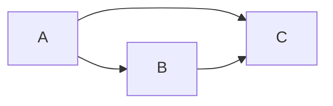
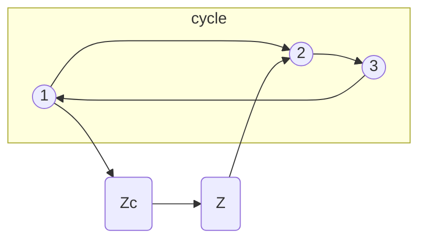
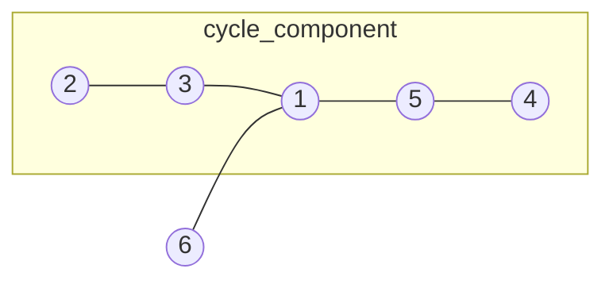

# Discrete math

> I am newbie on counting number.

-   Stanley-Style: enumeratic / algebric / geometry
-   Erdos-Style: extermal / probablistic

## Ch1. Pigeon-Hole Principle

#### Thm 1.1 (Pigeon-Hole Principle)

Let n and k be postiive integers, and let $n \geq k$. Suppose we have to place n identical balls into k identical boxes. Then there will be at least one box in which we place at least two balls.

(**pf**) by contradiction

**Example 1.2**: There is an element in the sequence 7, 77, 777, 7777, ... that is divisible by 2003.

solution: there are more than 2003 elements and 2002 possible remainders(mod 2003). for some i, jth remainders are same. $a_i - a_j$ be the $a_k * 10^k$.

-   [related problem](https://www.acmicpc.net/problem/8112)
-   prove that among eight integers, there are always two whose difference is divisible by seven.

**Example 1.5**: Ten points are given within a square of unit size. Then there are two of them that are close to each other than 0.48, and there are three of them that can be covered by a disk of radius 0.5

solution:

1. divide nine equal areas. some area contain more than 1. $\frac{\sqrt{2}}{3}<0.48$.
2. divide four equal areas in which connects the diagonal. some area contains more than 2.

---

**This is Elementary Counting Broh**

-   Double counting: help you.
-   Finding Bijection: you need to smart.

## Ch4. The Binomial Theorem and Related Identities

-   Catalan Number
-   [Young Diagram & Grassmannian](https://ocw.mit.edu/courses/18-212-algebraic-combinatorics-spring-2019/0ed77654f610e0432a288bb27abc202d_MIT18_212S19_lec8.pdf)

## Ch5. Partitions

### 5.1 Compositions

> distribute same n-object into different k-box.

#### Thm 5.2

For $n\geq k$, the number of weak composition of n into k parts is $\binom{n+k-1}{k-1}$.

**Cor**: # of composition = $\binom{n-1}{k-1}$

Q: what if k is not fixed?

weak composition -> infinite / composition $2^{n-1}$

---

### 5.2 Set Partitions

> distribute different n-object into same k-box

_Note_: # of perm $[n]$ into k non-empty block is $S(n, k)$("Stirling number")

**Cor**: $S(n, n-1)=\binom{n}{2}$, $S(n,1)=S(n,n)=1$

---

#### Thm 5.8

$n \geq k$, $S(n, k)=S(n-1, k-1)+kS(n-1, k)$

(**pf**) think the each case

1. n forms a singleton -> $S(n-1, k-1)$
2. not -> $kS(n-1, k)$

**Cor**: # of all surjective functions $f:[n]\to[k]$ is $k! S(n, k)$

---

#### Cor 5.10

For any real number $x$, and $n\in \mathbb{N}$. we have $x^n=\sum S(n, k)(x)_k$ ($(x)_k=x(x-1)...(x-k+1)$)

(**pf**) since both sides are polynomial. it is enough to prove (\*) for all positive $x$

Assume $x \in \mathbb{N}$, $x^n$ is # of $[n] \to [x]$.

$RHS = \sum_{size of im(f)}$ (# of possible Image I) $= \sum_{k}^{n} \binom{x}{k} k!S(n, k)$

Thus, $x^n=\sum S(n, k)(x)_k$.

**Def**: The nubmer of all set partition of $[n]$ into non-empty parts is denoted by $B(n):=\sum S(n, k)$(Bell number)

---

**HW 01 #3**: Let $B_k(n)$ be # of partitions of $[n]$ so that if i and j are in the same block, then $|i-j| \gt k$. Prove that $B_k(n)=B(n-k)$, for all $n \geq k$.

(**pf**)

B_k를 작은 구성요소로 나누어서 관찰해보면 $S(n, k)$와 동치인 것을 발견할 수 있고 $n-\alpha$일 때 조건을 만족하게 되어 이를 다시 재구성하면 증명 완.

**HW 01 #6**: Let $F(n)$ denote # of partitions of $[n]$ which contain no singleton blocks. Find a formula for the numbers of $F(n)$ in terms of the $B(n)$.

(**pf**) 포함-배제 원리

---

#### Thm 5.12

$B(n+1)=\sum \binom{n}{i} B(i)$

(**pf**) n+1 belongs to block of size (n-i+1)

---

### 5.3 Integer Paritition

> distribute same n-object into same k-box.

**Def**: Let $a_1 \geq a_2 \geq ... \geq a_k \geq 1$ s.t. $\sum a_i = n$

-   The sequence $(a_1, ..., a_k)$ is called a partition of n.
-   The # of partitions is denoted by $p(n)$ (Exactly k parts $p_k(n)$)

**Def**: A partition of n is self-conjugate if it is equal to its conjugate.

---

#### Thm 5.17

the # of partitions of n into at most k parts is equal to that of paritions of n into parts not larger than k.

(**pf**) by conjugation

---

#### Thm 5.18

the # of partitions of n into distinct odd parts is equal to that of all self conjugate parts of n.

(**pf**) construct the following bijection($f$: {self-conjugate partition} $\to$ {partition into distinctive odd parts})

i행 j열에 있는 원소를 min(i, j)번째 수에 더해준다. self-conjugate이기에 항상 distinct odd 개수만큼 counting 된다.

반대 방향이 있음도 자명하다.

---

#### Thm 5.22

Let $a=(a_1, ..., a_k)$ partition of n and let $m_i$ be the multiplicity of i as a part of a. Then # of set partition $[n]$ that are of $type({a})$ is equal to $P_a={\binom{n}{a_1 ... a_k}}/{\prod m!}$

(**pf**) trivial

**Def**: pentagonal number: $\frac{k(3k-1)}{2}$ for any integer k.

_Me_: 삼각수(triangular number)는 relu function의 (2d plane max division) - 1이다.

-   다음의 사실은 삼각수가 자연수 순서대로 더하는 성질 때문이다.
-   사각수는 홀수를 더한다.

---

**Lemma 2** [Bona Ch8]:

$\sum p(n)x^n=\prod \frac{1}{1-x^k}$

(**pf**) coeff of $x^n$ = # of $\{ (a_1, a_2, ..., a_n) | a_1 + 2 \times a_2 + ... + n \times a_n \}$

#### Thm 3: [Stanley ECI Prep 1.8.7]

$\prod (1-x^k) = \sum (-1)^k x^{\frac{n(3n-1)}{2}}$

(Franklin's **pf**) let $f(n) = q_e(n) - q_o(n)$, where $q_e(n)$(resp) is # of partition of n into an even number of distinct part. $\prod (1-x^k)=\sum f(n) x^n$ (trivial)

Hence, (WTS). $f(n)=(-1)^k$ if k is pentagonal number.

by defining involution $\pi(\lambda) \neq \pi(f(\lambda))$ ($\pi(\lambda) :=$ # of parts)

right most NE diagonal과 가장 아래 줄 원소 개수를 비교해서 더 적은 쪽을 많은 쪽으로 옮긴다. (involution이 된다!)

다음이 어긋날 때는 두 크기가 같을 때 아니면, 아래 부분이 1만큼 길때이다. 그 경우에는 odd/even 개수가 다른 한쪽이 하나가 더 많게 되고 이때를 구해보면 pentagonal number가 나온다.

-   [well-known theorem](https://en.wikipedia.org/wiki/Pentagonal_number_theorem)
-   [ps](https://codeforces.com/blog/entry/104312)

#### Thm 1

$p(n)=p(n-1)+p(n-2)-p(n-5)-p(n-7)...$

-> to prove this, we need to use generating ft.

(**pf**) By Lemma 2 and Thm 3

$(\sum p(n)x^n)(1-x-x^2+x^5+x^7+...)=1$

consider the coeff of $x^m$ (it's 0)

$p(m)=p(m-1)+p(m-2)-p(m-5)-p(m-7)...$

---

#### Thm 5.20

Let $g(n)$ be the number of partitions of n in which each part is at least two. Then $q(n) = p(n)-p(n-1), \forall n\geq 2$

(**pf**) subtract the case whose smallest part is 1.

**Cor**: least three. $q(n)=p(n)-p(n-1)-p(n-2)+p(n-3)$

---

## Ch6. Not So Vicious Cycles. Cycles in Permutations.

### 6.1 Cycles in Permutations

> permutation은 bijective function $[n] \to [n]$과 동형이다.

_Note_: you need to know the basics of Symmetric Group($S_n$).

**Cor**: All permutations can be decomposed into disjoint union of the cycles.

(**pf**)

1. By **lemma 6.4** each entry is a member of a cycle.
2. distinct cycles are disjoint.

---

_Note_: there are many ways to write same cycle decomposition.

**Def**: Canonical cycle form iff

1. each cycle is written with its largest first.
2. the cycles is written increasing order.

---

#### Thm 6.9

Let $a_1, ..., a_n$ be non-negative integer s.t. $\sum ia_i = n$.
Then # of n-permutatinos with $a_i$ cycles of length i is $\frac{n!}{\prod a_i! \prod i^{a_i}}$

(**pf**) easy to show

**Def**: $(a_1, ..., a_n)$ is called the type of cycle.

$f, g \in S_n$, $type(f) = type(g)$ iff $\exists h \in S_n$ s.t. $hfh^-1=g$

_Me_: conjugancy class! (결국 동형)

---

**Def**: # of n-perm with k cycles is called signless Stirling number of first kind and is denoted by $c(n, k)$.

The number $s(n, k)=(-1)^{n-k}c(n, k)$ is called a Stirling number of first kind.

#### Thm 6.12

let $n \geq k \gt 0$, then $c(n, k)=c(n-1, k-1)+(n-1)c(n-1, k)$

(**pf**)

1. 2~n까지 canonical form으로 적은 경우에 1을 추가한다고 생각(개인적으로 이게 깔금하다고 생각)
2. cycle 길이를 연장한다고 생각($b\to a$를 $b\to n \to a$로)

---

#### Lemma 6.13

$\sum c(n, k)x^k=x(x+1)...(x+n-1)$

(**pf**)

$x(x+1)...(x+n-1)(x+n)=\sum c(n+1, k)x^k \times x + \sum c(n+1, k)x^k \times n=\sum (c(n, k-1)+n \times c(n, k))x^k$

By **Thm 6.12**, $\sum (c(n, k-1)+n \times c(n, k))x^k=\sum c(n+1, k)x^k$

_Note_: $c(0, 0)=1$, $c(n, 0)=1$

By replacing $x$ by $-x$ and multiply $(-1)^n$ we have $\sum s(n, k)x^k = (x)_k$.

=> S(n, k) c(n, k) are entries of transition matrix between $\{1, x, x^2, ...\}$ and $\{1, (x)_1, (x)_2, ...\}$

#### Thm 6.14: Two matrices $[S(n, k)]_{n, k}$, $[s(n, k)]_{n, k}$ are inverse of each other.

---

### 6.2 Permutations with Restricted Cycle Structure

#### Lemma 6.15: Transition Lemma

g: permutation written in canonical cycle form. Then $g: S_n \to S_n$ is a bijection.

(**pf**)

1. g is well-defined (in group-theory it refers to output without ambiguity)
2. It is enough to construct an inverse

3) 사이클을 시작한다.
4) left-to-right maximum 원소가 나오기 전까지 오른쪽으로 이동한다.
5) permutation의 끝이 아니라면 1)로 돌아간다.

e.g. p=215436 -> (21)5436 -> (21)(543)(6)

---

**Prop 6.18**

let i and j be two elements of $[n]$. Then i and j are in the same cycle in exactly half of all permutation.

(**pf**) WLOG, assume $i=n, j=n-1$

Canonical cycle form으로 주어진 permutation을 작성했을 때 $n$과 $n-1$이 같은 사이클에 위치하는 경우는 $n-1$이 $n$ 뒤에 등장하는 것으로 이를 통해서 절반의 경우라는 것을 알 수 있음.

**Lemma 6.19**

$i \in [n]$ then probability of $i\in (k-cycle)=\frac{1}{n}$

(**pf**) WLOG, assume $i=n$

k-cycle 내부에 존재하는 경우는 n가 끝에서 k번째 위치할 때, 따라서 증명을 마침.

**Note**: i, j 대신 n-1, n으로 생각해도 괜찮은 이유는 택갈이.

---

**Def**: let ODD(m) (resp.) be the set of m-permutations with all cycles length is odd.

**Lemma 6.20**: $|ODD(2m)| = |EVEN(2m)|$

(**pf**)

ODD(2m)은 2k개의 사이클을 가진다.

to be continued

---

## Ch7. Sieve Method

-   someday...

---

## Ch8. Generating Ft.

-   someday I work

---

## Ch9. The origin of graph theory

### 9.1 Eulerian Trails

그래프 이론은 **쾨니히스베르크로(Königsberg)의 다리**의 이야기에서 시작된다. 칸트의 고향으로도 유명한 이 지역은 현재는 러시아의 영토로, 러시아 본토와 떨어져 있는 월경지로 위치한 특이한 지리적 특징을 가진다.

뒤에 서술되는 오일러 경로에 관한 thm으로 이 다리들을 건너지 못함을 알 수 있다. 현재는 5개의 다리가 남아 있으며 반증(물리)된 추론이다(?)

그래프 이론은 관계를 추상화 한다. 땅과 땅을 연결하는 다리를 그래프로 도식화한 것처럼, 세상의 많은 관계들은 그래프로 표현될 수 있다. All you need is graph!

**Def**

-   vertex/edge
-   $G = (V, E)$, $E={(v_1, v_2) \in V}$
-   `deg(A)` is # of edges connected to A (multiple edges&loop is allowed)

**Def**: If G has no loops, mutiple edges, G is `simple` graph.
**Def**: A sequence of (distinct) edge is called `walk`(resp. `trail`)

-   If trail uses all edge of G, we call it `Eulerian trail`.
-   If a trail does not touch any vertex twice, we call it `path`.
-   G is `connected` if $\forall x, y \in V$ $\exists path$ from x to y

**Def**: A `subgraph` H of G is graph (V, E가 G의 부분집합) / vertex의 연결이 유지되면 `induced subgrpah`

---

_RMK_: deg(loop) = 2 / connected component is defined by equivalence class

#### Thm 9.2

A connected graph G has a closed Eulerian trail iff all vertices of G has even degree.

(**pf**) intuitive: in/out

If A is a vertex that is not starting vertex of a closed Eulerian trail

deg(A)=2 -> trail distinct edges
deg(A)=2+2(# of visits of A in the middle)

(if part)

1. Take any vetex S and pick unused edge consecutively. Continue until a closed trail $C_1$ is formed.
2. If $C_1=G$, we are done. Otherwise, choose a vertex V in $C_1$ so that $C_1$ does not contain all edges adjacent to V. If $\nexists{V}$, then $\exists{a}$ not in $C_1$ but G is connected (contradiction).
3. remove all edges of $C_1$ from G and construct $C_2$ starting from V => $C_1 \cup C_2$ is closed trail!

**Cor 9.3**

A connected graph G has Eulerian trail which starts at S and ends at T iff S, T have odd degree, and other vertexes of G has even.

(**pf**) add ST edge and apply Thm 9.2

---

### 9.2 Hamiltonian Cycles

**Def**

-   cycle = a closed trail that does not touch any vertices twice except the initial vertex.
-   Hamiltonian cycle = a cycle that touch all vertices of graph

e.g. n명의 사람들이 있을 때 양옆에 친구가 앉도록 원탁에 배치하는 방법? (=Hamiltonian)

_RMK_: If G is not connected, $\nexists$Hamiltonian Cycle

Q: Given simple graph, how can we "quickly decide whether it has Hamiltonian Cycle or not?" (_quickly_ = $\exists$algorithm with `polynomial` f(n) steps)
A. we cannot.
-> the quesetion is equivalent to many other problems, called NP-complete problems. "complexity theory"

#### Thm (Ore, 1960)

$deg(x)+deg(y) \ge n$, $\exists 2 \leq i \leq n-1$ s.t. $(xz_i)(z_{i-1}y)$

where $x, y$ is not adjacent vertex

(**pf**)

otherwise {nbd of y} $\sqcup$ {vertices immediate precede neighbor of x} > $n-2$ $\square$

#### Thm 9.5

let $n \ge 3$, G: simple graph on n vertices. Assume that all vertices are of degree at least $\frac{n}{2}$.

Then G has a Hamiltonian Cycle.

(**pf**)

1. G has to be _connected_.
    - otherwise, $G=G_1 \cup G_2$ ($G_1$의 vertex 개수가 더 적다고 할 때 $deg(V) \ge \frac{n}{2}-1$ -> contradiction)
2. Assume that G does not have a Hamiltonian Cycle.
    - add new edges _as long as we can without Hamiltonian cycle_. call near graph by $G^1$
3. p := a path of maximal length in G
    - **Claim**: P contains all vertices of $G^1$
    - pick $x, y$ s.t. $(x, y)$ is not an edge since adding $(x, y)$ makes H cycle.(by _2_)
4. $x=z_1 ... z_n=y$ : vertices of this path. By **Thm (Ore, 1960)**, we can construct H cycle.(contradiction)

---

### 9.3 Directed Graph

**Def**: A directed graph G is strongly connected if for all vertices of a and b has $\exists$directed path

**Def**: G is balanced if $\forall v$, $in(v)=out(v)$ holds.

#### Thm 9.6

G has a closed Eulerian trail iff it is balanced and strongly connected.

(**pf**) omitted

---

**Def**: A simple undirected graph is complete if $\forall x, y \in G$ (x, y) is edge

**Def**: If we direct each edge of a complete graph, resulting directed graph called tournament.

#### Thm 9.7

All tournaments have a Hamiltonian path.

(**pf**) Induction on n

1. n=2: trivial
2. Assume statements for all tournaments belong $n-1$ vertices
    - Hamil path $h=h_1 h_2 ... h_{n-1}$
        - if $\exists i, h_i \to V \wedge V \to h_{i+1}$ -> we're done
        - otherwise, $in(V)=0 \vee out(V)=0$ 이기에 그냥 양끝에 연결할 수 있음.

#### Thm 9.8

A tournament T has Hamiltonian cycle iff it is strongly connected

(**pf**)

(=>) obvious

(<=)

1. Claim T contains a cycle
    - otherwise, 삼각부등식처럼 $xy, yz \in E(G) \Rightarrow xz \in E(G)$을 만족하게 되고 z에서 x로 가는 path가 불가능.
2. let $c=y_1...y_k$ be a cycle of maximal and assume that c is not Hamiltonian.
    - $\forall i$와 $v \notin c$가 $y_i \to v$이거나 $v \to y_i$일 것이다. (otherwise, 길이 확장 가능)
    - $y_i$로 모두 나가거나, 들어가는 것들의 집합을 각각 $Z, Z^C$라고 할 때, 둘 다 공집합이 아니다. (otherwise, strongly connected 망가짐)
    - 더 긴 cycle을 만들 수 있으므로 모순이다.

### 9.4 The Notion of Isomorphisms

**Def**: We say that G and H is isomorphic if $\exists$bijection $f: V(G)\to V(H)$ s.t. # of edges between X and Y of G = f(X) and f(Y) of H.

-   connected, multiset of degrees are preserved
-   there is no efficient way to test two graphs are isomorphic.

---

## Ch10. Trees

### 10.1 Minimally Connected Graphs

**Def**: A graph has no cycle is acyclic.

-   forest = acyclic graph
-   tree = connected acyclic graph
-   leaf: vertex of deg = 1

#### Thm 10.1

G: connected simple then TFAE

(1) G is minimally connected
(2) G does not contain a cycle

(**pf**):

-   (1)=>(2): 사이클이 있다고 가정.
    -   **Claim**: If $(a, b) \in cycle$, then $G \setminus (a, b)$ is still connected. -> trivial (a, b)를 지날거 cycle 경로를 따라 이동하세요!
    -   by Claim, we are done.
-   (2)=>(1): minimally connected 되지 않았다고 가정.
    -   $\exists a, b$ 에서 $a \to b$ 경로가 2개 있음.
    -   cycle이 만들어짐.

#### Cor 10.3

A connected graph H is a tree iff for each pair of vertices (x, y), $\exists!$path x and y

(**pf**)

(=> only if) H has to be minimally connected

(<= if) 사이클이 있다고 가정하면 path 여러개가 됨.

---

#### Lemma 10.5

A tree T has at least 2 leaves in T.

(**pf**) consider any path of maximal length in T.

#### Thm 10.4

All trees on n vertices have n-1 edges. Conversely, all connected graphs on n vertices with exactly n-1 edges are trees.

(**pf**) delete one leaf(**Lemma 10.5**) and use induction hypothesis

---

#### Thm 10.7: Cayley's formula

The number of all trees with a vertex set $[n]$ is $A_n = n^{n-2}$

(**pf**) (Andre Juyal)

choose two vertices and call them start & end

=> # of doubly rooted traces = $n^2 A_n$=$n^n$

(Goal) bijection with the set of $f:[n] \to [n]$

1. 사이클에 속한 정점을 정렬해 모은 집합 C
2. 함수를 적용한 이미지 $f(C)$를 일렬로 나열하고 양 끝을 시작, 끝이라고 생각.
3. C에 속하지 않은 j에 대해서 $j \to f(j)$ 간선 연결.
    - Claim: always tree (사이클을 분리했기 때문에 자명)

ex) 123456->231541 = (123)(45), f(C)={_2_,3,1,5,_4_} (doubly rooted!)

#### Cor 10.9

The # of rooted forests on $[n]$ is $(n+1)^{n-1}$

(**pf**) make a one global root and apply **Thm 10.7**

---

### 10.2 Min Spanning Trees

**Def**: G: connected / T is spanning tree of G if G and T have the same vertex set and each edge of T is also edge of G.

#### Lemma 10.11

F, F' two forests on same vertex set V. Assume that # of E(F) < # of E(F')

Then $\exists e \in E(F')$ s.t. $F \cup e$ is still forest.

(**pf**) Assume that there is no such edge

-   모든 엣지가 추가 되었을 때 사이클을 만든다.
-   모든 F'의 엣지가 F의 connected component 안에 있다.(=F의 connected component가 같거나 더 적다)
-   모순이다. 다음을 얻는다. #(connected component F) > #(connected component F')

#### Thm 10.12 (Kruskal Algorithm)

(**pf**) Assume otherwise

-   greedy way: $T=t_1, ..., t_{n-1}$
-   minimum way: $H=h1,...,h_{n-1}$

& $\exists i\geq 2$ s.t. $\sum^{i} w(h_j) < \sum^{i} w(t_j)$ and $\sum^{i-1} w(h_j) \geq \sum^{i-1} w(t_j)$

$w(h_i) < w(t_i)$이기에, **Lemma 10.11**을 사용해서 $T_{<i-1}$와 $H_{<i}$에서 greedy way에 사이클을 만들지 않으면서 추가할 수 있는 엣지가 있다. 따라서 이걸 추가할 수 있는 것은 모순이다.

---

### 10.3 Graphs and Matrices

**Def**: G: undirected graph on labeled vertices. nxn matrix A by stting $A_{ij}$=# of edges between i and j. We called A adjacency matrix of G.

**Def**: G: directed, then $A_{ij}$=# of edges from i to j

#### Thm 10.16

G: graph w/ labeled vertices. Then $(A^k)_{ij}$=# of walk from i to j of length k.

#### Thm 10.17

Let G be a simple graph on n vertices, and let A be the adjacency matrix of G. Then G is connected iff $(I + A)^{n−1}$ consists of strictly positive(> 0) entries.

(**pf**) 이항전개

---

### 10.4 The Number of Spanning Trees of a Graph
